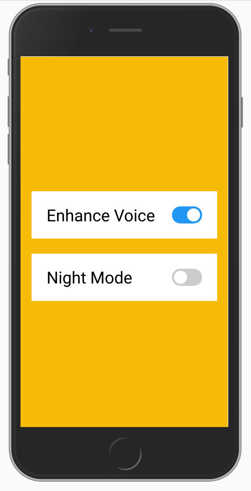

# Marantz Controller

Controls a Marantz AMP via Telnet by either a local web site or infrared commands from a LG remote control.

## Installation
- Clone this repo
- `npm install`
- Update Marantz IP address in `night-mode-toggler.js`

## Running app
`node app.js`

Visit `http://<localhost>:8080` which will show the available options to control the Marantz Amp:

### Infrared Control
Install and configure LIRC for your system and update the listeners at the bottom of `app.js`

## Tips
- Use PM2 to keep the app running.
- pm2 restart all (will restart the app with any new changes)
- pm2 stop all (will stop the app)
- pm2 unstartup (will prevent the app from running on boot)
